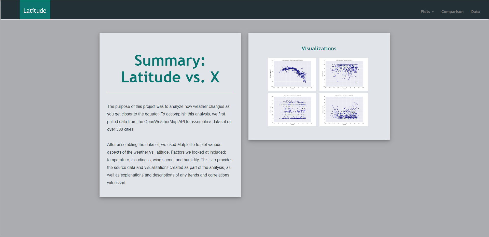
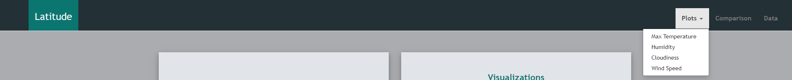
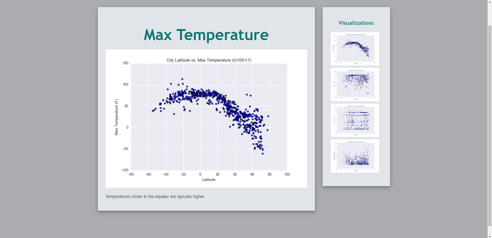
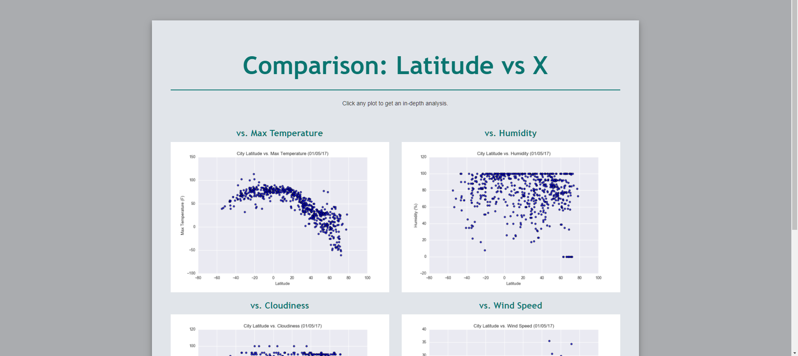
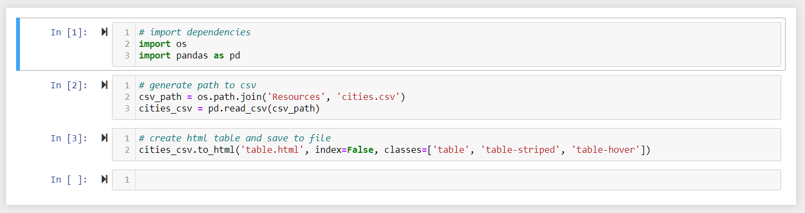

# Weather Trends Dashboard

# Prompt

Create a visualization dashboard for weather trends related to latitude and longitude. Deploy the dashboard to GitHub pages. Ensure that the dashboard can function on mobile displays.

*Note: The focus of this project was web design so images and weather data were provided.  
Visit https://github.com/NPVoravong/weather-trends to see an example of how I created my own weather data and charts.*

# Dependencies
- HTML
- Bootstrap
- CSS
- GitHub Pages
- Jupyter Notebook
- Pandas

# Process

  1. Initial Setup and Schematic Design

     The landing page for the dashboard will be the `index.html`. Bootstrap will be used to arrange the page elements. The CSS for bootstrap needs to be referenced in the head and the script needs to be referenced in the body. Another CSS file `style.css` is used to handle to the aesthetics of the dashboard.
  
     The dashboard will be comprised of the following pages:
      - Plots
      - Comparison
      - Data

     A html file will be required for each of these pages.
     
  2. [Home Page](https://npvoravong.github.io/latitude/)

     The home page consists of two divs and a navbar.

     
     
     The div on the left summarizes the dashboard. Paragraph tags are used to add the text with styling for the div coming from the CSS.
     ```
     .description-content {
      /* Box-model */
      padding: 30px;

      /* Positioning */
      margin-top: 32px;

      /* Visual */
      background-color: #e1e5ea;
      box-shadow: 0 4px 8px 0 rgba(0, 0, 0, 0.2), 0 6px 20px 0 rgba(0, 0, 0, 0.19);
      }
     ```
     The div on the right is the four visualizations. Each image is clickable and links to a larger version of the chart with extra information. You can also get to the visualizations from the plots dropdown on the navbar.

  3. Navbar

     Bootstrap has built in functionality for creating a navbar. It will allows easy navigation around the dashboard. On the header of the page.
     
     
     
     The logo on the left gives the page some branding. An anchor tag is added to the button which allows a user to return to the homepage by clicking on the logo. The styling for the bar and logo is handled in `style.css`
     
     ```
     
     .navbar-custom {
      background-color: #233036;
      }
     
     #logo {
      /* Box-model */
      height: 75px;
      padding-top: 30px;
      padding-bottom: 10px;
      padding-left: 15px;
      padding-right: 15px;

      /* Positioning */
      margin-left: 60px;
      font-family: "Trebuchet MS", Helvetica, sans-serif;

      /* Typography */
      font-size: 18pt;
      color:whitesmoke;

      /* Visual */
      background: #0b7570;
      }
     ```
     
     The links to the other pages are populated on the nav bar using an unordered list. Alignment of the text is handled with class tags from the bootstrap CSS.
     ```
     <ul class="nav navbar-nav navbar-right navbar-right-custom">
     ```
     The plots page is made up of four different html files. Like the logo, the page links are within an anchor tag to make them clickable. Adding dropdown functionality will make all four weather visualizations accessible from the navbar. The dropdown-toggle class adds this feature. An unordered list is used to populate the dropdown menu. 
     ```
     <li class="dropdown">
                <a href="#" class="dropdown-toggle" data-toggle="dropdown" role="button" aria-haspopup="true" aria-expanded="false">Plots <span class="caret"></span></a>
                <ul class="dropdown-menu">
                 <li><a href="visualizations/temp.html">Max Temperature</a></li>
                  <li><a href="visualizations/humidity.html">Humidity</a></li>
                  <li><a href="visualizations/cloudiness.html">Cloudiness</a></li>
                  <li><a href="visualizations/wind.html">Wind Speed</a></li>
                </ul>
              </li>
     ```

  4. [Plots](https://npvoravong.github.io/latitude/visualizations/temp.html)

     Each plot (cloudiness, humidity, temp, and wind) uses the same html template that includes the bootstrap, CSS references, main div, and sidebar div. Bootstrap is used to give the enlarged visualization nine columns with the side bar getting the remaining 3. I created a class in the CSS called `.img-wrap` to ensure the enlarged image always displays properly
     ```
     .img-wrap {
      display: block;
      max-width: 100%;
      height: auto;
      }
     ```
     The sidebar is all four visualization and allows a user another means to navigate between them. To help the user see which image they are on a opacity is added to each square on hover.
     ```
     #logo:hover {
      /* Visual */
      opacity: 0.7;
      }
     ```
     
       
     
  5. Comparison

     The comparison page allows all four visualizations to be seen together. Each image is clickable and links back to the plots page. This page uses the same template as the html files from the plots page.
     
     
     
  6. [Data](https://npvoravong.github.io/latitude/data.html)

     The data page is where a user can see the raw information for all 546 cities in the dataset. For the purposes of this project the dataset was converted from a CSV to a html table using pandas.
     
     
     
     The output of the pandas conversion in `data.html` as a table. Each city is a tr and the metadata for the cities is a td. Each column is labeled using a table header.
     ```
     <thead>
            <tr style="text-align: center">
              <th>City_ID</th>
              <th>City</th>
              <th>Cloudiness</th>
              <th>Country</th>
              <th>Date</th>
              <th>Humidity</th>
              <th>Lat</th>
              <th>Lng</th>
              <th>Max Temp</th>
              <th>Wind Speed</th>
            </tr>
          </thead>
          <tbody>
            <tr>
              <td>0</td>
              <td>jacareacanga</td>
              <td>0</td>
              <td>BR</td>
              <td>1528902000</td>
              <td>62</td>
              <td>-6.22</td>
              <td>-57.76</td>
              <td>89.60</td>
              <td>6.93</td>
            </tr>
     ```
     
     It is important that the div for the table get placed inside another div that has the container class. This will give the table the same look and feel as the rest of the dashboard. To account for mobile screens the responsive class is added to a div that wraps the entire table. If the class is just applied to the table tag it doesn't format properly.
     
# The final dashboard is available here https://npvoravong.github.io/latitude/
